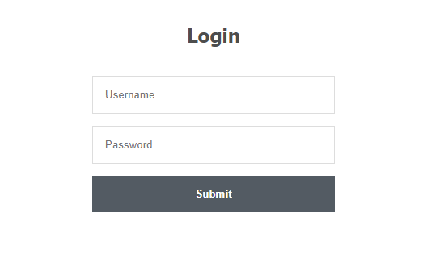
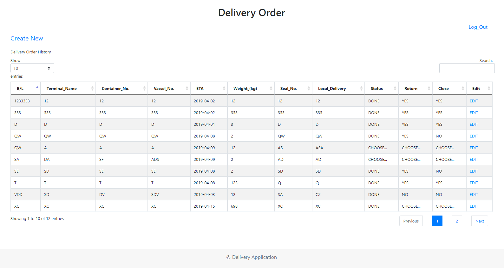
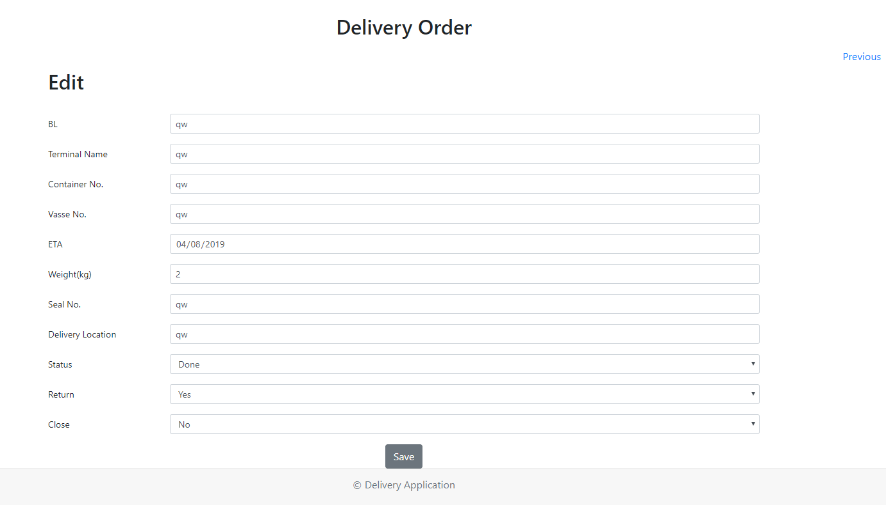
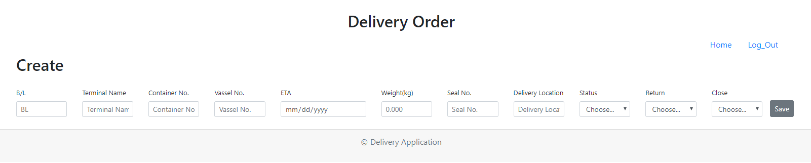
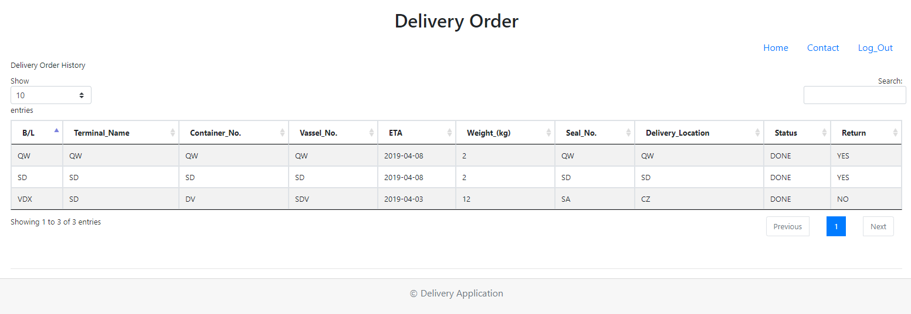
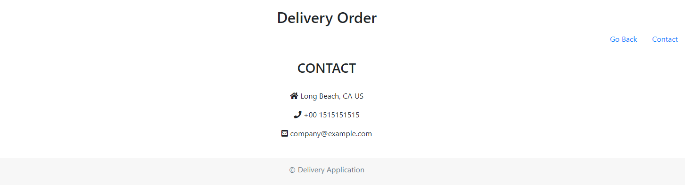

# DeliveryGate-MySQL-Login-Admin-and-User-Login-out

Delivery Gate Application is a internal delivery order system. The core concept is a simple application that can quickly add delivery information.   

## Technologies Used
HTML, CSS, Bootstrap, JavaScript, jQuery, AJAX, MySQL, NPM, Node.js

### Delivery Order Information Function

* Create
* Edit

## To Install

* Git Clone the repository
* Navigate to the folder where the repository exists using Git Bash or Terminal
* Run the command `npm install` to download the required dependencies
* Then run the command `node server.js` to run the program

## To Login

* Customer Login (Only see delivery order history)

   - ID: user1

   - PW: user1

* Admin Login (Create and Edit delivery order)

   - ID: admin1

   - PW: admin1

## Screenshot
* Login Page

  

* Admin Main Page

* Admin Edit Page

* Admin Create Page

* Customer Main Page

* Customer Contact Page

